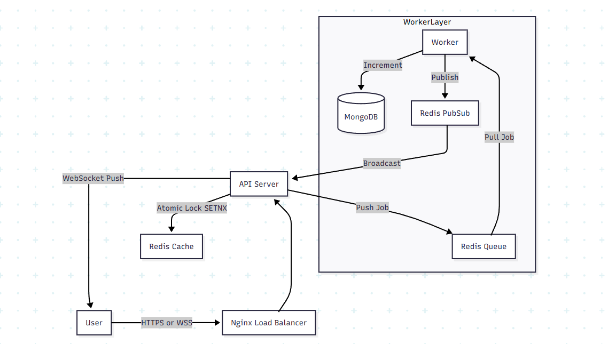

# Opus – Distributed Event-Driven Polling System

Opus is an enterprise-grade real-time polling platform engineered to handle massive concurrent traffic ("Thundering Herd") with sub-20ms latency.

Unlike standard CRUD apps, Opus utilizes an Asynchronous Producer-Consumer Architecture to decouple vote ingestion from processing, ensuring system stability even under heavy load.

## System Architecture

The system is designed as a distributed microservices cluster.



## Key Engineering Challenges Solved

### 1. The "Thundering Herd" Problem

**Challenge:** 10,000 users voting effectively simultaneously causes database lockups and API timeouts.

**Solution:** Implemented a Producer-Consumer pattern. The API accepts requests instantly, pushes them to a Redis Queue, and returns 202 Accepted. A separate Worker process consumes these votes at a controlled rate (concurrency: 5), protecting the database.

### 2. Distributed Real-Time Synchronization

**Challenge:** In a scaled environment with 3 API replicas, a user connected to Server A needs to see votes processed by Server B.

**Solution:** Used Redis Pub/Sub as a message broker. When the Worker updates the DB, it broadcasts a message. All API replicas subscribe to this channel and push updates to their connected WebSocket clients.

### 3. Concurrency & Data Integrity

**Challenge:** Race conditions allowing users to double-vote or corrupt vote counters.

**Solution:** 
- **Layer 1 (Cache):** Redis Atomic Locks (SETNX) with TTL for immediate deduplication.
- **Layer 2 (DB):** MongoDB Atomic Operators ($inc, $push) with array filters.

## Tech Stack

| Domain | Technologies |
|--------|---------------|
| **Frontend** | React 19, TypeScript, Tailwind CSS, Framer Motion, Vite |
| **Backend** | Node.js, Express, TypeScript, WebSockets (ws) |
| **Data** | MongoDB (Persistence), Redis (Queue, Pub/Sub, Caching) |
| **DevOps** | Docker, Nginx (Reverse Proxy), GitHub Actions (CI) |
| **Monitoring** | Winston (Structured Logging), Prometheus (Metrics) |

## ⚡ Quick Start (Docker)

The entire infrastructure can be spun up with a single command.

### Clone the Repository

```bash
git clone https://github.com/developeranil65/opus.dev.git
cd opus.dev
```

### Create Environment Variables

Copy `.env.sample` to `.env` in both root and server directories.

### Launch Infrastructure

```bash
docker-compose up --build
```

### Access Application

- **Frontend:** http://localhost
- **API:** http://localhost/api/v1

## Performance Benchmarks

- **Ingestion Rate:** ~2,500 req/sec (tested with K6)
- **End-to-End Latency:** < 400ms (Vote -> UI Update)
- **Database CPU:** Stable < 40% usage during load tests due to Queue buffering.

## Author

Anil Singh | Backend & DevOps Engineer | [LinkedIn](https://www.linkedin.com/in/anilsingh-ln/) • [GitHub](https://github.com/developeranil65/)